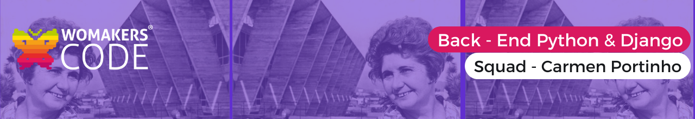

#  Desafio de Testes

Realizar os cursos da Microsoft:
> [Introdução a testes no Python](https://learn.microsoft.com/pt-br/training/modules/python-get-started-testing/) - Comece testes com o Python usando o módulo unittest. Conheça outros conceitos de teste, como testes funcionais e de integração.

> [Fazer testes com Pytest](https://learn.microsoft.com/pt-br/training/modules/test-python-with-pytest/) - Aprimore a sua experiência de teste com o Pytest, uma ótima opção para escrever, executar e estender testes em Python. Seja exposto a padrões úteis e às noções básicas dos testes com o Pytest.

> [Teste Avançado com Pytest](https://learn.microsoft.com/pt-br/training/modules/python-advanced-pytest/) - Crie acessórios Pytest personalizados para código reutilizável e aprimorar os testes de várias entradas com parametrização.

##  Índice 
- [Organização para resolução dos exercícios](#organizacao)
- [Exercício – Gravar um teste de unidade com o módulo unittest](#unittest) 
- [Exercício - Fazer testes com o Pytest](#pytest)
- [Exercício - Teste avançado com Pytest](#avancado)
- [Integrantes do Squad](#integrantes)

##  Organização para resolução dos exercícios 
> Os exercícios foram resolvidos em grupo através de chamadas via Discord e organizados de acordo com um quadro Kanban no Trello:

> Todas realizaram os cursos solicitados e fizeram individulmente seus exercícios, juntamos aos poucos ao repositório principal para registrar a contribuição.

>⚠️ Algumas das participantes não contribuíram diretamente por meio de commits no repositório, mas contribuíram através das chamadas, como eram poucos exercícios acabaram não contribuindo efetivamente no repositório. É importante ressaltar que TODAS, SEM EXCEÇÃO, PARTICIPARAM ativamente do projeto.

##  Exercício – Gravar um teste de unidade com o módulo unittest 
> Neste exercício, você aproveitará o módulo unittest, que está incluído na biblioteca padrão do Python para gravar testes e corrigir bugs. A aprovação nos testes garante que o código esteja se comportando conforme o esperado, aumentando a confiança de que as novas alterações não estão quebrando a funcionalidade anterior.

- 📌 Etapa 1 – Adicionar um arquivo a este exercício
- 📌 Etapa 2 – Executar os testes e identificar a falha
- 📌 Etapa 3 – Corrigir o bug e fazer com que os testes passem
- 📌 Etapa 4 – Adicionar novo código com testes
- 📌 [Verificar seu trabalho](./Introdução%20a%20testes%20no%20Python/Código%20completo/test_exercise.py):
    - Uma função `str_to_bool()`
    - Um bloco `try/except` na função `str_to_bool()` que captura `AttributeError`.
    - Uma classe de teste `TestStrToBool()` que herda de `unittest.TestCase`.
    - Pelo menos três métodos de teste que testam entradas para a função `str_to_bool()`.

##  Exercício - Fazer testes com o Pytest 
> Neste exercício, você usará o Pytest para testar uma função. Em seguida, você encontrará e corrigirá alguns problemas potenciais na função que causam falhas nos testes. É essencial examinar as falhas e usar os relatórios de erros avançados do Pytest para identificar e corrigir bugs ou testes problemáticos no código em produção.

- 📌 Etapa 1 – Adicionar um arquivo com testes para este exercício
- 📌 Etapa 2 – Executar os testes e identificar a falha
- 📌 Etapa 3 – Corrigir o bug e fazer com que os testes passem
- 📌 Etapa 4 – Adicionar novo código com testes
- 📌 [Verificar seu trabalho](./Fazer%20testes%20com%20o%20Pytest/test_exercise.py):
    - Uma função `admin_command()` que aceita um argumento e um argumento de palavra-chave.
    - Uma exceção `TypeError` com uma mensagem de erro útil na função `admin_command()`.
    - Uma classe de teste `TestAdminCommand()` que tem um método auxiliar `command()` e três métodos de teste que verificam a função `admin_command()`.

##  Exercício - Teste avançado com Pytest 
> Neste exercício, você usará Pytest com a parametrização para testar uma função. Em seguida, você atualizará uma classe de teste para usar um acessório em vez de um método setup() e teardown(). Usar a parametrização e trabalhar com acessórios permitirá que você se torne mais flexível ao criar ou atualizar testes.
- 📌 Etapa 1 – Adicionar um arquivo com testes para este exercício
- 📌 Etapa 2 – Executar os testes e explorar o relatório
- 📌 Etapa 3 – Mover um teste existente para um acessório
- 📌[Verificar seu trabalho](./Fazer%20testes%20com%20o%20Pytest/test_exercise.py):
    - Uma função `str_to_bool()` que aceita uma cadeia de caracteres e retorna um valor booliano dependendo do conteúdo da cadeia de caracteres.
    - Dois testes parametrizados para a função `str_to_bool()`, um que testa os valores verdadeiros e outro que testa os valores falsos.
    - Um acessório de Pytest personalizado que usa o acessório `tmpdir()` para criar um arquivo concluído temporário com alguns conteúdos.
    - Uma classe de teste que usa o acessório `tmpfile()` personalizado para criar o arquivo.

##  Integrantes 

<table>
    <tr>
        <td>
            <a href="https://github.com/alynebrasil"> <b>Alyne Brasil</b></a> <a href="https://github.com/alynebrasil">👩‍💻</a>
        </td>
        <td>
            <a href="https://github.com/anamariagds"> <b>Ana Maria Gomes</b></a> <a href="https://github.com/anamariagds">👩‍💻</a>
        </td>
        <td>
            <a href="https://github.com/cibelemoraes"> <b>Cibelle Moraes</b></a> <a href="https://github.com/cibelemoraes">👩‍💻</a>
        </td>
        <td>
            <a href="https://github.com/danisoaresl"> <b>Daniele Soares</b></a> <a href="https://github.com/danisoaresl">👩‍💻</a>
        </td>
        <td>
            <a href="https://github.com/gabiapp"> <b>Gabriela Nunez</b></a> <a href="https://github.com/gabiapp">👩‍💻</a>
        </td>
    </tr>
    <tr>
        <td>
            <a href="https://github.com/GessycaBorges"> <b>Gessyca Borges</b></a> <a href="https://github.com/GessycaBorges">👩‍💻</a>
        </td>
        <td>
            <a href="https://github.com/OrcFofa"> <b>Laura Santos</b></a> <a href="https://github.com/OrcFofa">👩‍💻</a>
        </td>
        <td>
            <a href="https://github.com/Renatarafaelaalves"> <b>Renata Rafaela Alves</b></a> <a href="https://github.com/Renatarafaelaalves">👩‍💻</a>
        </td>
        <td>
            <a href="https://github.com/thaynarlt"> <b>Thayná Tolentino</b></a> <a href="https://github.com/thaynarlt">👩‍💻</a>
        </td>
    </tr>
</table>

